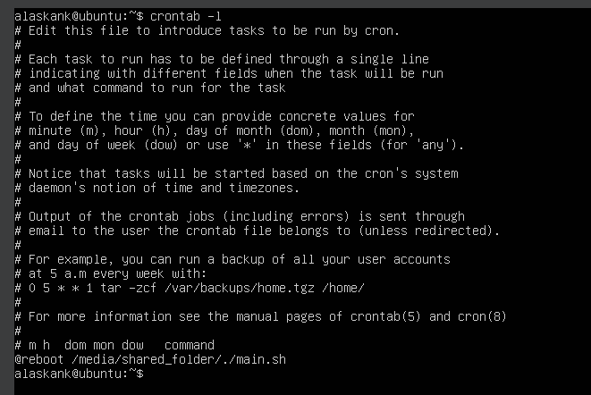
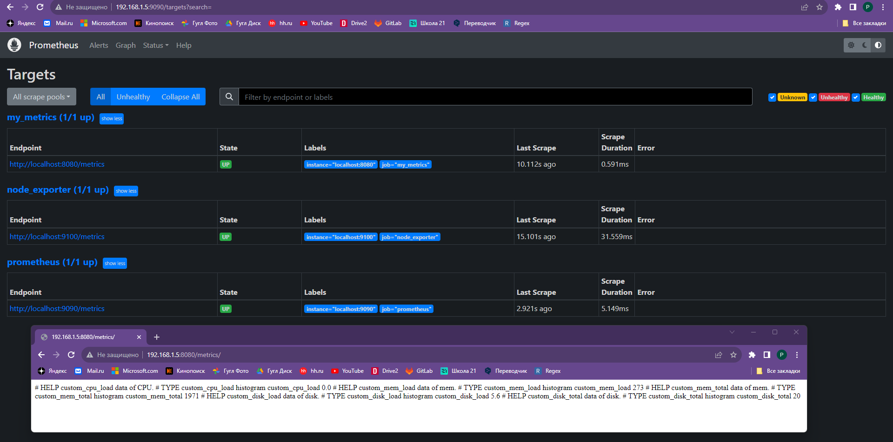
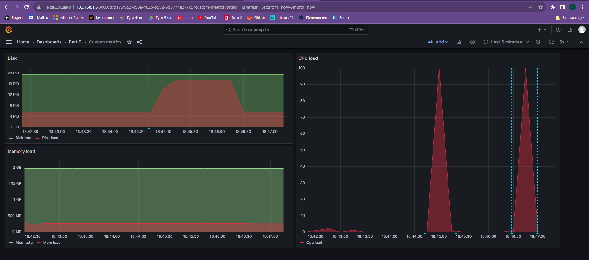

## Part 9. Дополнительно. Свой node_exporter
1. Install nginx;
2. Скрипт написан на bash с бесконечным циклом и с задержкой в самом скрипте в 5 секунд, скрипт запускается от cron при запуске системы;
  - 
3. Changed the "default" file in the "sites-available" folder, opened port 8080 in nginx and added opening the index.html file to read the metrics for Prometheus;
  - 
4. Modified file "prometheus.yml"
5. Tests in part 7:
 - 
6. Using manual:
 - https://webcache.googleusercontent.com/search?q=cache:m1VaTVHxjzQJ:https://sysdig.com/blog/prometheus-metrics/&cd=5&hl=ru&ct=clnk&gl=ru
 - https://xakep.ru/2015/09/25/prometheus-monitoring/
 - https://www.youtube.com/watch?v=T2Q1MQHn358&t=17s
 - https://www.youtube.com/watch?v=7XJoCZ4wsoc&t=84s
 - https://www.youtube.com/watch?v=YUabB_7H710&t=1133s