## Part 1. Готовый докер
1. Взять официальный докер образ с nginx и выкачать его при помощи docker pull  
2. Проверить наличие докер образа через docker images  
3. Запустить докер образ через docker run -d [image_id|repository]  
4. Проверить, что образ запустился через docker ps  
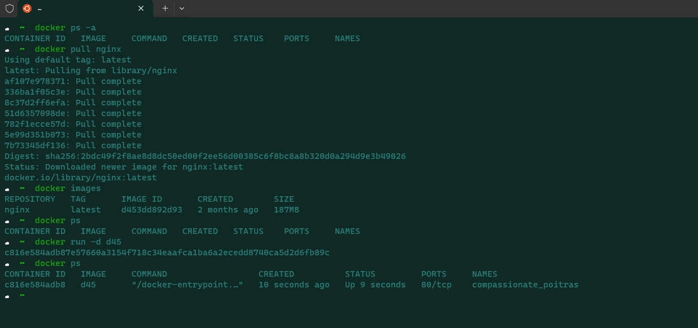
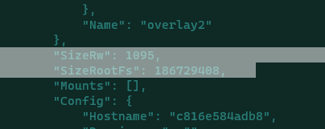
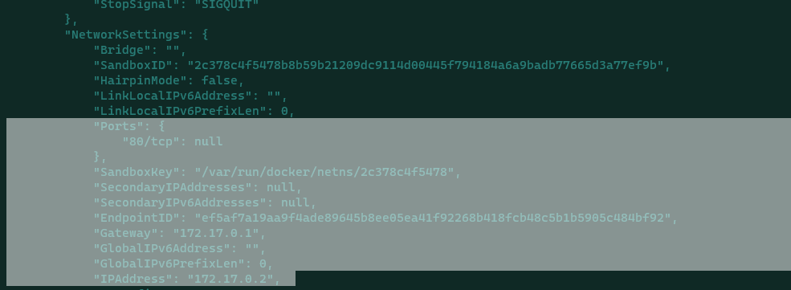
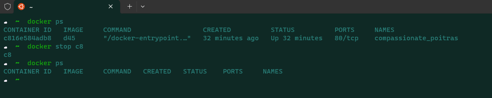
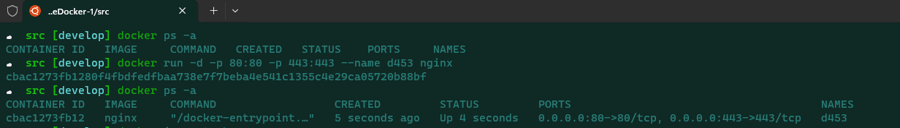  
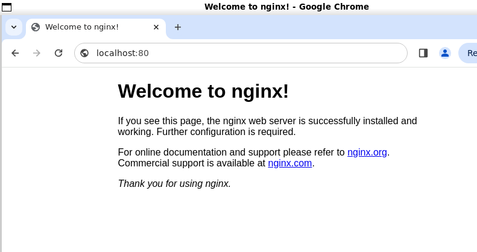  
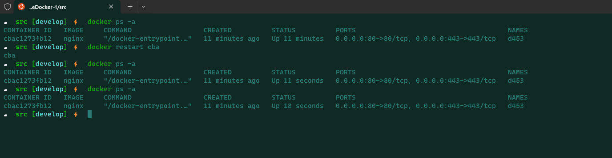  
## Part 2. Операции с контейнером
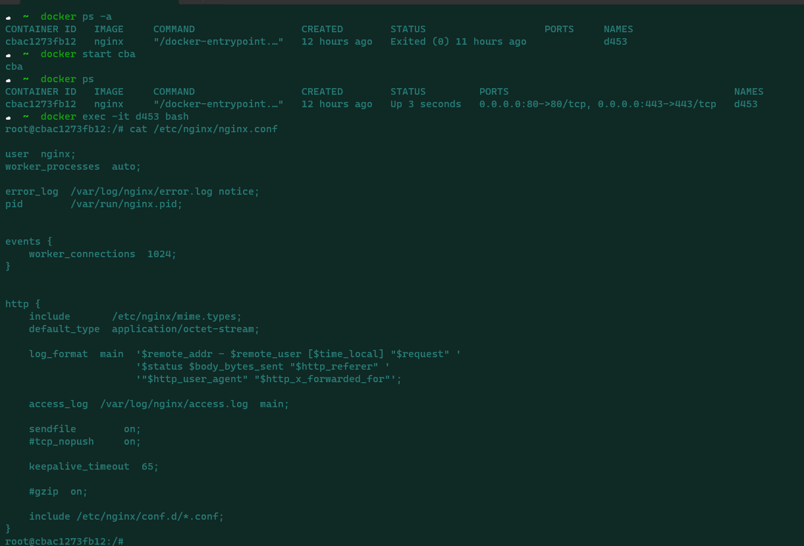
1. Создать на локальной машине файл nginx.conf  
2. Настроить в нем по пути /status отдачу страницы статуса сервера nginx  
3. Скопировать созданный файл nginx.conf внутрь докер образа через команду docker cp 
4. Перезапустить nginx внутри докер образа через команду exec  
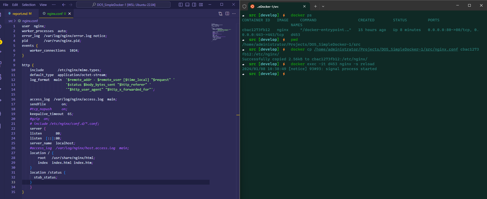  
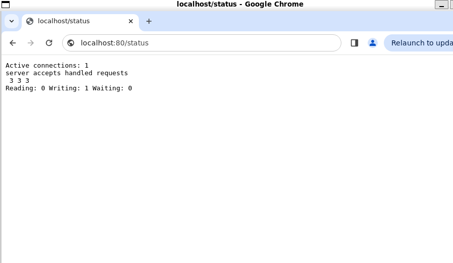
5. Экспортировать контейнер в файл container.tar через команду export  
6. Остановить контейнер  
7. Удалить образ через docker rmi [image_id|repository], не удаляя перед этим контейнеры  
8. Удалить остановленный контейнер  
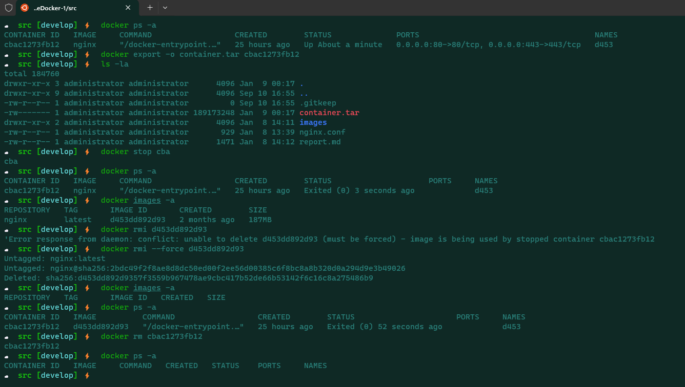
9. Импортировать контейнер обратно через команду import  
10. Запустить импортированный контейнер  
11. Проверить, что по адресу localhost:80/status отдается страничка со статусом сервера nginx  
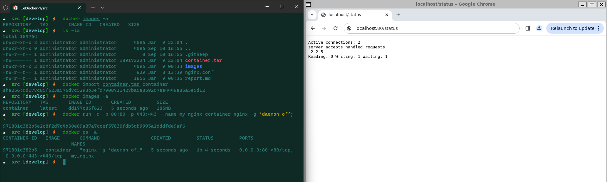
## Part 3. Мини веб-сервер
1. Мини сервер на C и FastCgi, который будет возвращать простейшую страничку с надписью Hello World! и конфигурационный файл ngnix.conf    
2. Для компиляции кода на С с использованием FastCGI была установлена библиотека FastCGI командами:
- sudo apt-get update  
- sudo apt-get install libfcgi-dev  
- компиляция gcc hello_world.c -lfcgi -o hello_world.fcgi    
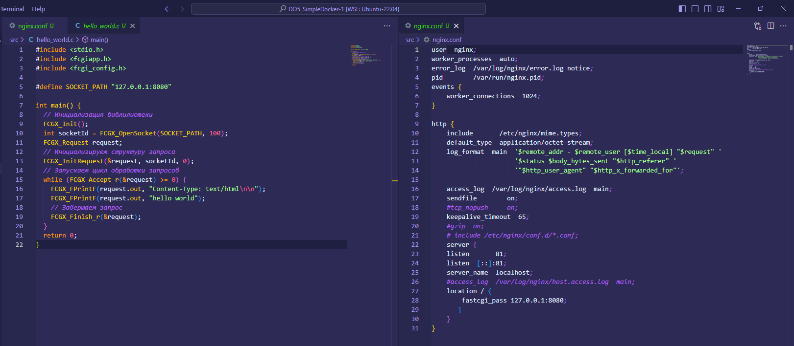
3. Запустили контейнер, перенесли файлы в наш контейнер и перезагрузили nginx  
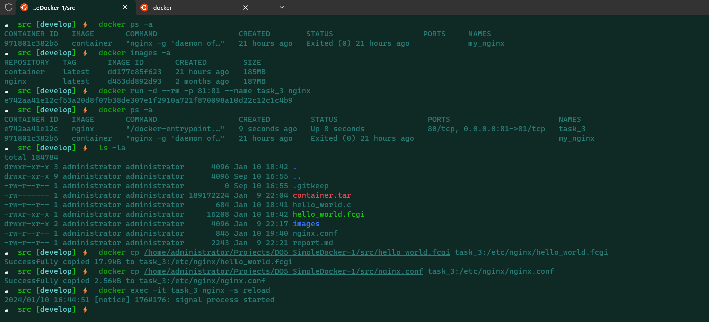
4. Установка библиотеки libfcgi.so.0 командами:  
- apt-get update
- apt-get install libfcgi0ldbl
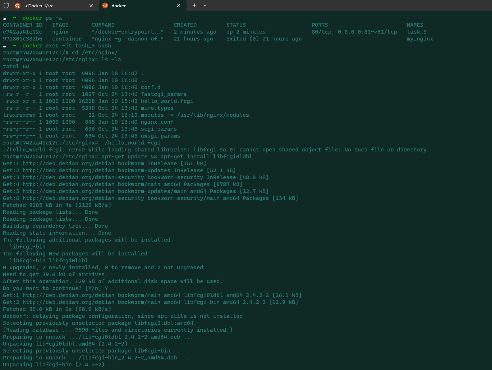
5. Запуск двоичного кода на С в контейнере и проверка localhost:81  
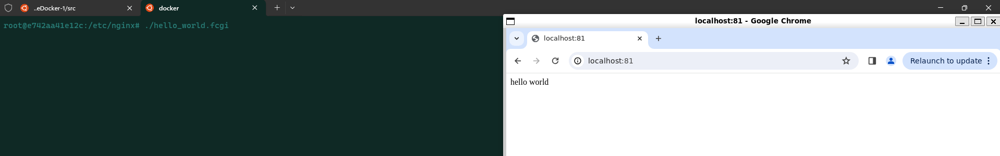
## Part 4. Свой докер
Собрали написанный докер образ через docker build при этом указав имя и тег  
Проверили через docker images, что все собралось корректно  
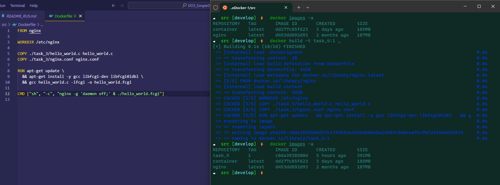
Запустили собранный докер образ с маппингом 81 порта на 80 на локальной машине и маппингом файла ./nginx внутрь контейнера по адресу, где лежат конфигурационные файлы nginx'а (см. Часть 2)  
Проверили, что по localhost:80 доступна страничка написанного мини сервера  
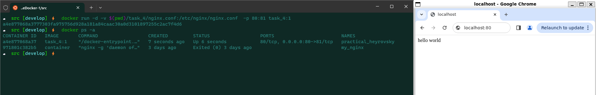
Дописали в ./nginx/nginx.conf проксирование странички /status, по которой надо отдавать статус сервера nginx  
Перезапустили докер образ  
Проверили, что теперь по localhost:80/status отдается страничка со статусом nginx
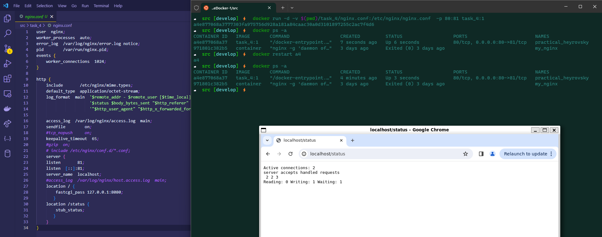
## Part 5. Dockle
Просканировать образ из Part 4 с помощью dockle   
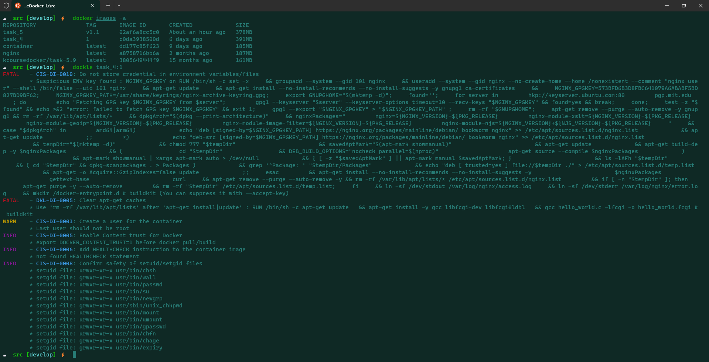
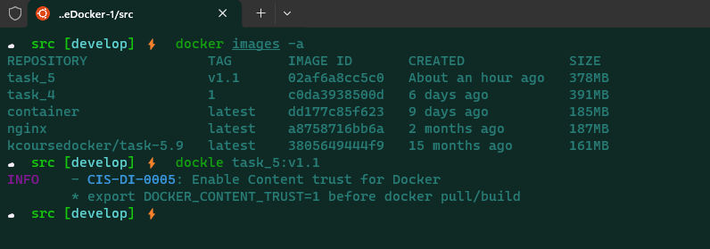
## Part 6. Базовый Docker Compose
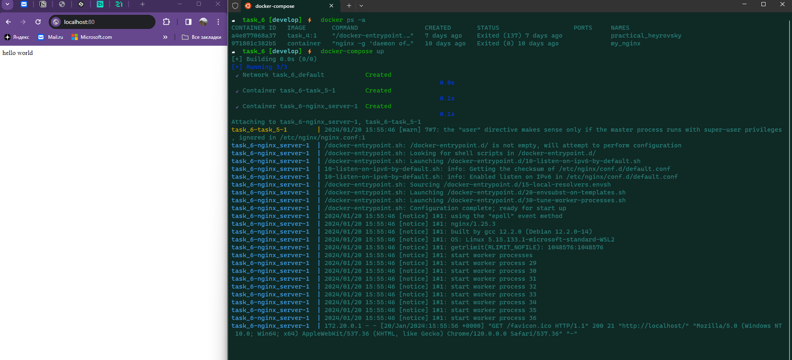
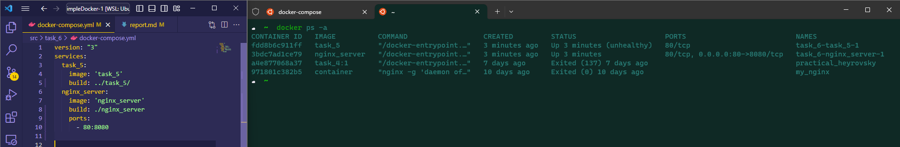