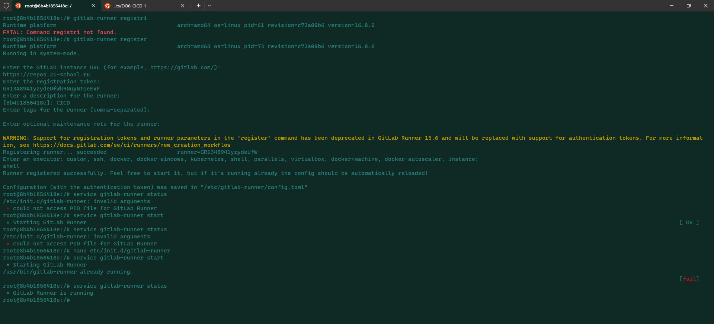
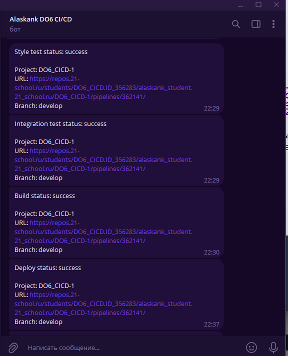

## Part 1. Настройка gitlab-runner
1. Написал Dokcerfile для контейнера;  
2. Зарегистрировал gitlab-runner по этому мануалу: https://sysadmintalks.ru/install-gitlab-runner/;  
3. После регистрации столкнулся с проблемой, что runner не запускается, решением было добавление:  
   - DAEMON="/usr/bin/gitlab-runner" в файл etc/init.d/gitlab-runner  
   - Решение нашел на форуме: https://gitlab.com/gitlab-org/gitlab-runner/-/issues/3445   
   - 
## Part 2. Сборка
1. Создал файл .gitlab-ci.yml;  
2. Настроил stage build;
3. Статьи:
    - https://habr.com/ru/companies/softmart/articles/309380/  
    - https://habr.com/ru/articles/764568/
## Part 3. Тест кодстайла
1. Настроил stage style_test;  
## Part 4. Интеграционные тесты
1. Настроил stage integration_test;
## Part 5. Этап деплоя  
1. Настроил stage deploy;  
2. Написал Dokcerfile для контейнера;  
3. Сгенерировали ssh ключ: ssh-keygen;  
4. Запустили ssh: service ssh start;  
5. Для подключения по ssh без подтверждения создали файл ~/.ssh/authorized_keys и положили туда открытый ключ с машины gitlab-runner;
6. Статья: https://habr.com/ru/articles/122445/;  
## Part 6. Дополнительно. Уведомления
1. Пользовался мануалом с офф сайта gitlab: 
    - https://docs.gitlab.com/ee/user/project/integrations/telegram.html;
2. Статья: https://ifedyukin.ru/blog/all/gitlab-ci-telegram/;
3. 
